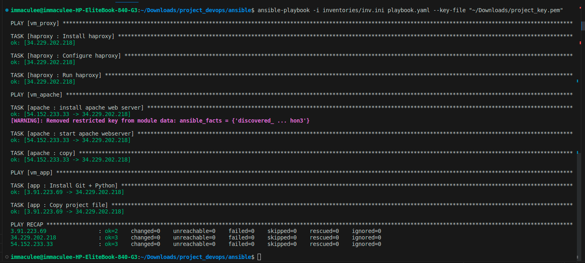

# Ansible

***
Dans ce projet, nous avons utiliser ansible pour automatiser la configuration des serveurs qu'on veut déployer sur nos instances créé avec terraform.

Pour notre configuration,por éviter des problèmes de sécurité comme j'en ai un peu parler du côté de terraform, nous avons décidé d'utiliser le serveur haproxy comme bastion qui sera donc le point d'accès sécurisé pour les autres serveurs.
Les rôles des serveurs apache et de l'aplication ont donc été `delegate_to` au serveur haproxy qui exécutera ces rôles.


## Explication des fichiers et dossiers

Dans notre configuration, nous avons créé les rôles `apache`, `app` et `haproxy`contenant chacun des fichiers pour exécuter des tâches spécifiques nécessaires au déploiement de nos serveurs.

Notre dossier "inventories" contient le fichier `inv.ini` utilisé pour stocker nos instances individuels ainsi que les groupes d'instances sur lesquels ansible va exécuter des tâches. Ce dossier contient également le dossier `group_vars` contenant des données sensibles pour notre configuration.

Le fichier `ansible.cfg` est utilisé pour configurer le comportement d'Ansible et définir des options globales pour les commandes et notre playbook

Le fichier `playbook.yaml` contient les instructions et les tâches à exécuter sur nos instances cibles.

### Quelques commandes ansible

```
    - ansible all -m ping
    - ansible-playbook -i inventories/inv.ini playbook.yaml --key-file <chemin vers votre clé privé>
```

#### Illustration de l'exécution d'un playbook ansible
