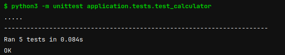
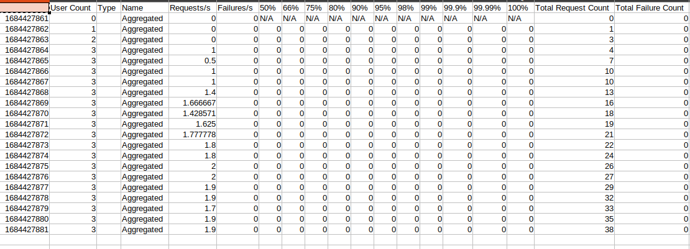
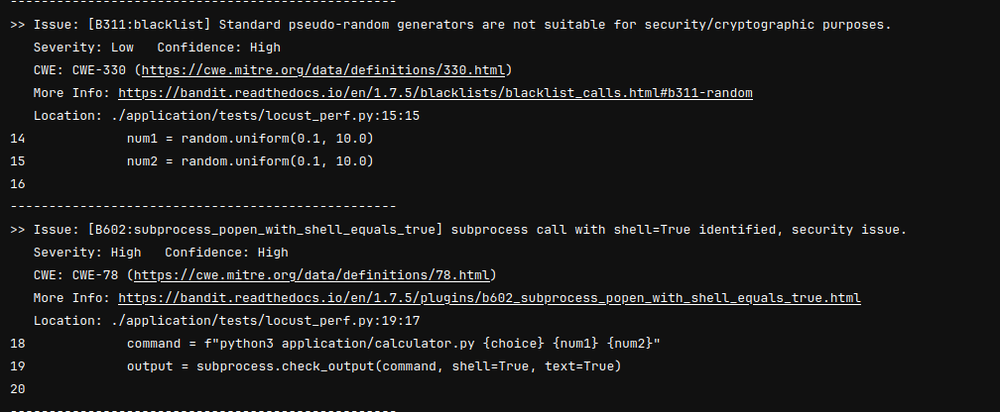
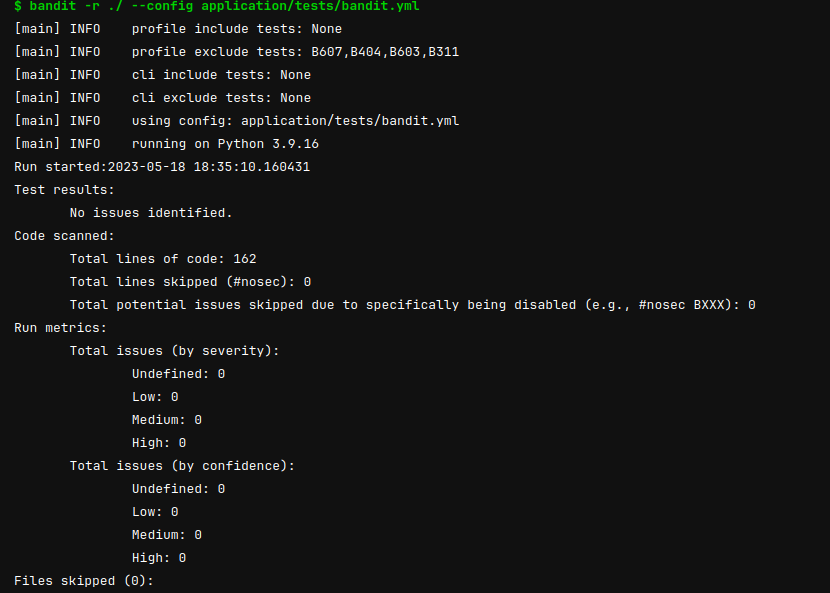

# Calculator Application 

Dans ce répertoire on retrouve :.

- l'application de calculatrice : calculator.py.
- les tests de performances : tests/performance.py.
- les  tests unitaires : tests/test_calulator.py.
- la configuration pour les tests de sécurité du code : tests/bandit.yml
  

## Calculatrice

C'est une calculatrice basique coder en python.


### Fonctionnement
L'application prend en entrée les input des utilisateurs en tapant l'opération que l'n souhaite effectuer et puis les nombres. 
```bash
python3 application/calculator.py [choice] [number1] [number2] 
Choice : 
# 1 : addition
# 2 : substract
# 3 : multiply
# 4 : divide
```

## Tests

### Unit test
J'ai crée des tests unitaire pour chaque option de la calculatrice à l'aide d'
***unittest*** qui est un module intégré à la bibliothèque standard de Python qui fournit un framework pour écrire et exécuter des tests unitaires. 
Avec la librairie **subprocess**, il est possible de simuler une commande pour
lancer l'application dans le script python. Le résultat est ensuite tester via
le *self.assertEqual* pour vérifier que les résultats de l'application sont bien
ceux attendus. 
Il y a 5 tests en tout, pour l'*addition*, la *soustraction*, la
*multiplication*, la *division* et la *division par zéro*.

.

Sur l'image, on peut voir que tout les tests passent bien et tout est **OK**

### Performance Test
Pour les tests de performances, j'ai utilisé ***locust*** qui est un framework open source de tests de charge et de performances écrit en Python. Il permet de simuler des utilisateurs simultanés et de mesurer les performances d'une application ou d'un système.
Pour lancer les tests on a la commande. : 
`
    - locust -f application/tests/locust_perf.py --headless -u 5 -r 1 --run-time 30s --csv=performance
`
- l'option *f* permet de spécifier où se trouve les tests a effectuer 
- *--headless* : exécute Locust en mode sans interface utilisateur graphique, s'exécutera en arrière-plan sans afficher l'interface web de suivi des performances.
- *-u 5* : Spécifie le nombre d'utilisateurs simultanés (utilisateurs virtuels) à simuler lors du test.
- *-r 1* : Spécifie la cadence à laquelle les utilisateurs virtuels envoient des requêtes par seconde. 
- *--run-time 30s* : Définit la durée totale d'exécution des tests.
- *--csv=performance* : Spécifie le nom du fichier CSV dans lequel les résultats
  des tests seront enregistrés pour pouvoir être utilisés pendant le monitoring.
  L'image ci-dessous montre les résultats qu'on peut avoir et qui indique par
  exemple le nombre de requete par seconde.

.


### Security Test
Pour les tests de sécurité sur le code, j'ai chosi **Bandit** qui est un outil d'analyse statique de sécurité pour les programmes Python. L'objectif principal de Bandit est d'identifier les vulnérabilités et les failles de sécurité dans le code source Python.
Quand on lance la commande : 
`  - bandit -r ./ --config application/tests/bandit.yml `
Cela va lancer l'analyse dans tout le dossier, et va suivre les configurations
qu'on spécifie dans le fichier bandit.yml.
Ci-après une analyse et des problèmes de sécurités trouvés par **bandit**.


.


Le rapport comprend : 
- **CWE du mitre**
- **Severité** 
- **Ligne contenant le problème**.


Dans notre cas, le problème de crypto n'était pas vraiment un soucis comme on
générait juste des chiffres random pour faire le choix. Le deuxième était plus
important et je l'ai corrigé.

.


Quand il n' y a plus de soucis dans notre code, on a l'aperçu ci-dessus qui
montre que tout est *OK*
Bandit relève toutes les vulnérabilités dans le codes qui sont **connues** et aide à identifier les points faibles potentiels du code Python en termes de sécurité et à prendre les mesures nécessaires pour corriger les problèmes détectés.

