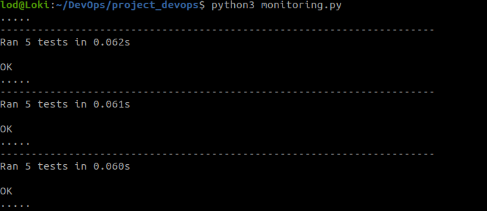
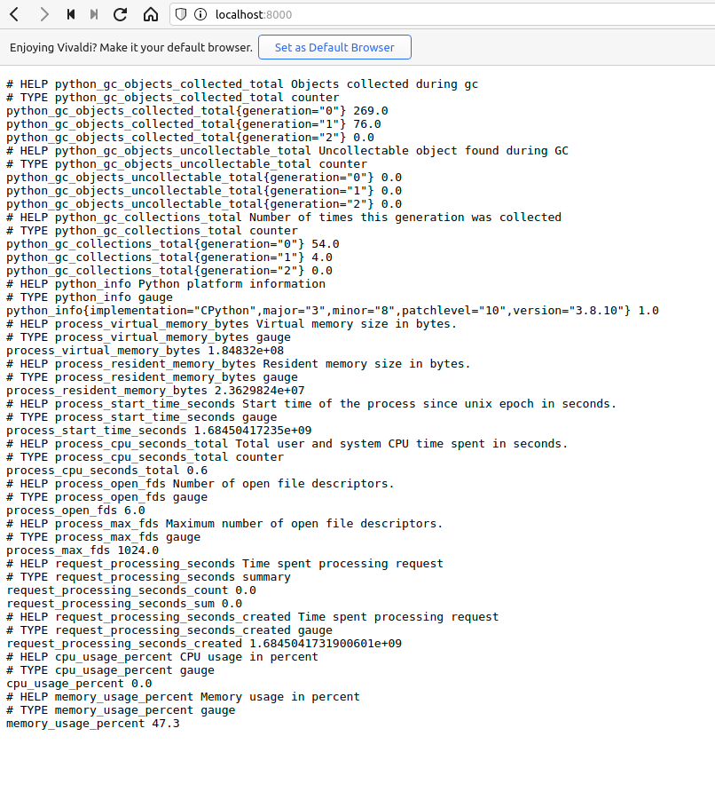
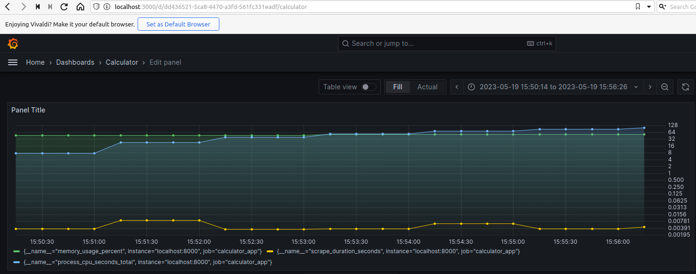

# Monitoring

### Les Outils

Nous avons opté pour l'utilisation de Prometheus et Grafana pour répondre à nos besoins en matière de monitoring et visualisation des métriques système. Dans cette introduction, nous allons vous expliquer pourquoi nous avons choisi ces deux outils et comment ils ont contribué à améliorer notre processus de développement et de déploiement.

Prometheus, tout d'abord, est un système open-source de monitoring et d'alerting. Il est capable de collecter, stocker et traiter une grande quantité de données de métriques en temps réel.Ce qui nous permet de surveiller efficacement notre environnement et de collecter les métriques nous paraissant pertinentes pour notre application.

En ce qui concerne Grafana, c'est un outil de visualisation de données open-source qui nous offre une interface conviviale pour explorer et analyser les métriques collectées par Prometheus. Grafana nous permet de créer des tableaux de bord personnalisés avec des graphiques interactifs, des jauges, des diagrammes en camembert et d'autres visualisations percutantes. Nous avons choisi Grafana car il est une référance dans le domaine du monitoring, il offre une grande flexibilité dans la création de visualisations adaptées à nos besoins spécifiques.

En utilisant Prometheus et Grafana ensemble, nous avons pu bénéficier d'un puissant système de surveillance et de visualisation des métriques. Nous avons mis en place des tableaux de bord personnalisés pour surveiller les performances de nos applications ainsi que la consommation des ressources.

# Lancer le server Prometheus

Nous pouvons demarré le server Prometheus de la facon suivante :

    $python3 monitoring.py

Le programme va alors lancer une série de test Prometheus trackera les métriques qui nous interesse pour les transmettre ensuite au server Grafana.

Nous pouvons ensuite accéder a ces metrics dans : http://localhost:8000.

Mais pour qu'elles soient plus accessible et plus graphique nous importons ces metrics dans Grafana : 

