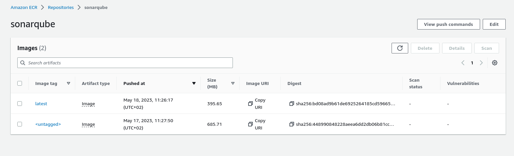

# Sonarqube
***
Ce dossier comprend les fichiers utilisés pour le déploiement de sonarqube.


## Explication des fichiers et dossiers

Le fichier `Dockerfile` est notre fichier de configuration utilisé pour créer notre image `sonarqube`. Il définit donc les instructions nécessaires pour que Docker construise notre image de manière reproductible et automatisée.

Le fichier `stack.yaml` contient le code nécessaire pour  créer une infrastructure qui exécute SonarQube en tant que conteneur à l'aide d'ECS (Elastic Container Service) et stocke l'image dans l'ECR. 


### Quelques commandes ansible

```
    - aws ecr get-login-password --region us-east-1 | docker login --username AWS --password-stdin 304757654481.dkr.ecr.us-east-1.amazonaws.com
    - docker build -t sonarqube .
    - docker tag sonarqube:latest 304757654481.dkr.ecr.us-east-1.amazonaws.com/sonarqube:latest
    - docker push 304757654481.dkr.ecr.us-east-1.amazonaws.com/sonarqube:latest
    
```


#### Illustration de l'image sonarqube déployée


