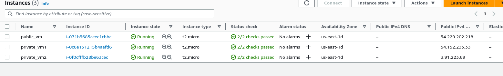

# Projet Devops

***
Dans ce projet, nous avons opter pour la création de trois instances AWS. La première instance sera utilisé pour y configurer un serveur `haproxy`, la deuxième un serveur `apache` et la troisième instance pour notre application.
Le serveur haproxy jouera donc le rôle de load-balancing pour les 2 autres serveurs. 

Pour des questions de sécurité, généralement les entreprises restreignent l'accès au port 22 pour la connexion ssh à un bastion qui servira d'entée pour les autres instances. Nous avons donc opter dans notre security group à l'utilisation du port 20022 au lieu du port 22.

## Prerequisites

1. Terraform
2. Ajouter les credentials AWS vers le chemin "~/.aws" dans le fichier `credentials` en local


## Terraform
Plusieurs fichiers ont été créé pour notre déploiement.

Le fichier `backend.tf` comme son nom l'indique contient le backend S3 d'AWS pour stocker l'état de notre infrastructure Terraform.

Le fichier `provider.tf` nous a permis de déclarer le fournisseur AWS qu'on a utilisé et spécifier la région `us-east-1` comme région cible pour nos ressources Terraform.

Le fichier `output.tf` nous a permis de déclarer les sorties (outputs) de notre infrastructure. Nous avons donc pu récupérer les adresses IP privées et publiques de nos instances.

Le fichier `main.tf` est notre fichier principal de configuration. Nous y avons déclarer nos différentes ressources, notre security group, notre vpc, notre subnet, ...
Toutes ces ressources sont nécessaires pour la créations de nos instances.

Le fichier ` file.yml` est un userdata qu'on a utilisé pour configurer le port `20022` au lieu du port 22 utilisé par défaut pour les connexions ssh.


### Quelques commandes terraform

```
    - terraform init
    - terraform fmt
    - terraform validate
    - terraform plan
    - terraform apply -auto-approve
```

#### Illustration des instances créés

